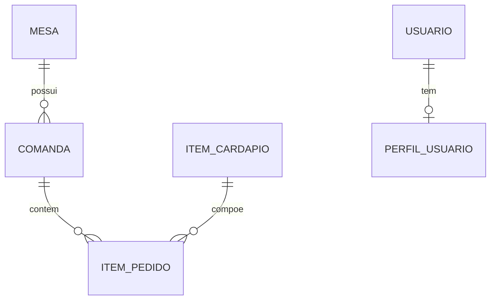
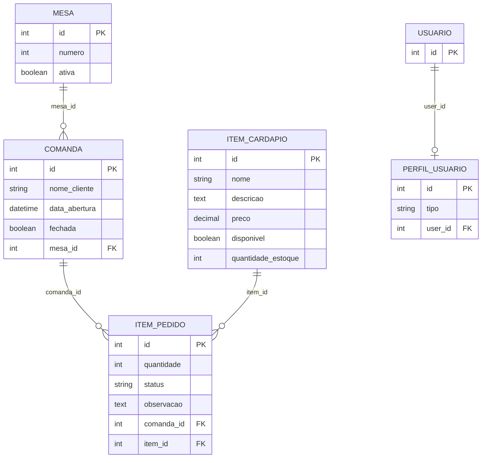

# Relatório de Modelagem de Banco de Dados
## Projeto: Comanda Vovó Rosa

## 1. Escopo do Banco de Dados
Este banco de dados modela o processo de atendimento de um restaurante, contemplando controle de mesas, abertura de comandas, registro dos itens pedidos, cardápio e perfil de usuários do sistema.

Para fins acadêmicos (DER conceitual e lógico), o foco está nas entidades de negócio do app `pedidos`, sem detalhar todas as tabelas técnicas internas do framework Django.

---

## 2. DER Conceitual

### 2.1 Entidades de Negócio
- **Mesa**
- **Comanda**
- **ItemCardapio**
- **ItemPedido**
- **Usuário**
- **PerfilUsuario**

### 2.2 Relacionamentos e Cardinalidades
1. **Mesa (1) — (N) Comanda**
   - Uma mesa pode ter várias comandas ao longo do tempo.
   - Cada comanda pertence a uma única mesa.

2. **Comanda (1) — (N) ItemPedido**
   - Uma comanda possui vários itens pedidos.
   - Cada item pedido pertence a uma única comanda.

3. **ItemCardapio (1) — (N) ItemPedido**
   - Um item do cardápio pode aparecer em vários itens pedidos.
   - Cada item pedido referencia um único item do cardápio.

4. **Usuário (1) — (0..1) PerfilUsuario**
   - Um usuário pode ter no máximo um perfil de função no sistema.
   - Cada perfil pertence a um único usuário.

### 2.3 Diagrama Conceitual (Mermaid)

---

## 3. DER Lógico (Modelo Relacional)

### 3.1 Esquema Relacional

1. **MESA**(
   - `id` PK,
   - `numero` INT NOT NULL,
   - `ativa` BOOLEAN NOT NULL
)

2. **COMANDA**(
   - `id` PK,
   - `nome_cliente` VARCHAR(100) NOT NULL,
   - `data_abertura` DATETIME NOT NULL,
   - `fechada` BOOLEAN NOT NULL,
   - `mesa_id` FK NOT NULL → MESA(`id`)
)

3. **ITEM_CARDAPIO**(
   - `id` PK,
   - `nome` VARCHAR(100) NOT NULL,
   - `descricao` TEXT NOT NULL,
   - `preco` DECIMAL NOT NULL,
   - `disponivel` BOOLEAN NOT NULL,
   - `quantidade_estoque` INT NOT NULL
)

4. **ITEM_PEDIDO**(
   - `id` PK,
   - `quantidade` INT NOT NULL,
   - `status` VARCHAR(10) NOT NULL,
   - `observacao` TEXT NOT NULL,
   - `comanda_id` FK NOT NULL → COMANDA(`id`),
   - `item_id` FK NOT NULL → ITEM_CARDAPIO(`id`)
)

5. **PERFIL_USUARIO**(
   - `id` PK,
   - `tipo` VARCHAR(10) NOT NULL,
   - `user_id` FK NOT NULL → USUARIO(`id`)
)

> Observação: no banco físico do Django, a entidade **USUARIO** corresponde à tabela `auth_user`.

### 3.2 Diagrama Lógico (Mermaid)

---

## 4. Dicionário de Dados

## 4.1 Tabela: MESA (`pedidos_mesa`)
- **id**: identificador da mesa (chave primária).
- **numero**: número da mesa exibido no salão.
- **ativa**: indica se a mesa está ativa no sistema.

## 4.2 Tabela: COMANDA (`pedidos_comanda`)
- **id**: identificador da comanda (chave primária).
- **nome_cliente**: nome do cliente responsável pela comanda.
- **data_abertura**: data e hora de abertura da comanda.
- **fechada**: status de fechamento (aberta/fechada).
- **mesa_id**: referência para a mesa da comanda.

## 4.3 Tabela: ITEM_CARDAPIO (`pedidos_itemcardapio`)
- **id**: identificador do item de cardápio.
- **nome**: nome do produto.
- **descricao**: descrição textual do produto.
- **preco**: valor do item.
- **disponivel**: informa se está disponível para venda.
- **quantidade_estoque**: quantidade atual em estoque.

## 4.4 Tabela: ITEM_PEDIDO (`pedidos_itempedido`)
- **id**: identificador do item pedido.
- **quantidade**: quantidade solicitada do item.
- **status**: status operacional do pedido (`ABERTO`, `PRONTO`, `ENTREGUE`).
- **observacao**: observações do cliente/cozinha.
- **comanda_id**: referência da comanda à qual o item pertence.
- **item_id**: referência do item de cardápio pedido.

## 4.5 Tabela: PERFIL_USUARIO (`pedidos_userprofile`)
- **id**: identificador do perfil.
- **tipo**: papel do usuário no sistema (ex.: gerente, atendente, cozinha).
- **user_id**: referência para o usuário do Django (`auth_user`).

---

## 5. Regras de Negócio Evidenciadas no Modelo
- Não existe comanda sem mesa associada.
- Não existe item pedido sem comanda e sem item de cardápio.
- O histórico de pedidos é preservado por meio da entidade ITEM_PEDIDO.
- O perfil funcional do usuário é separado da autenticação padrão do Django.
- O controle de estoque está incorporado na entidade ITEM_CARDAPIO pelos atributos `quantidade_estoque` e `disponivel`.
- Ao registrar ITEM_PEDIDO, o sistema decrementa `quantidade_estoque`; quando chega a zero, marca `disponivel = false`.

## 5.1 Observação sobre a Modelagem de Estoque
Neste projeto, **estoque não é uma entidade separada** no banco atual. Ele foi modelado de forma simplificada dentro de ITEM_CARDAPIO.

Isso explica por que não existe uma tabela chamada "estoque" no DER lógico atual.

Se a disciplina exigir uma modelagem mais completa, uma evolução recomendada é criar uma entidade de movimentação, por exemplo:
- **MOVIMENTACAO_ESTOQUE**(`id`, `item_cardapio_id`, `tipo_movimentacao`, `quantidade`, `data_hora`, `origem`)

Com isso, além do saldo atual, também é possível manter rastreabilidade histórica de entradas e saídas.

---

## 6. Observação para Apresentação
Se a professora solicitar o DER "completo do banco físico", inclua também as tabelas técnicas do Django (`auth_*`, `django_*`).
Se o foco for **modelagem de domínio**, este relatório (entidades de negócio) é o formato mais adequado para avaliação acadêmica.